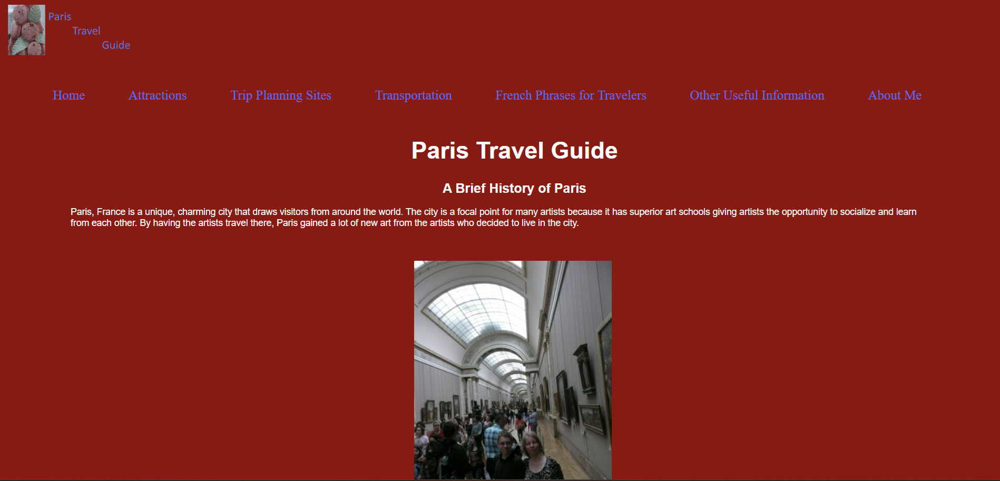
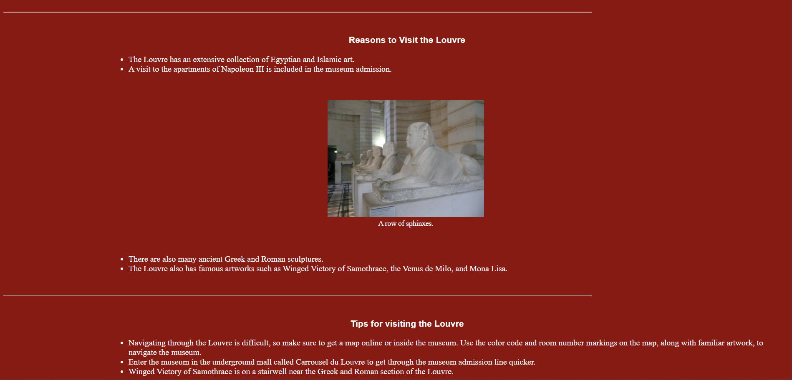

# Paris Travel Guide

This is a multipage responsive website I created to help people traveling to Paris, France. I created the website for a school project in my HTML class. The goals of this project are to learn:

* HTML
* CSS
* JavaScript

The purpose of the website is to provide unique and practical advice and information for people traveling to Paris, France.

###### Screenshot of the "Home" section of the website
---

###### Screenshot of the "Attractions" section of the website
---

###### Screenshot of the "Trip Planning Sites" section of the website
---

###### Screenshot of the "Transportation" section of the website
---

###### Screenshot of the "French Phrases for Travelers" section of the website
---

###### Screenshot of the "Other Useful Information" section of the website
---

###### Screenshot of the "About Me" section of the website

## Author

- [@Phil94comp](https://www.github.com/Phil94comp)

## Technologies Used

* HTML5
* CSS3
* Javascript

## Features

* Multi-page responsive website
* Internal and external hyperlinks
* Menus
* Images with captions
* Color themes using the colors from the French Flag
